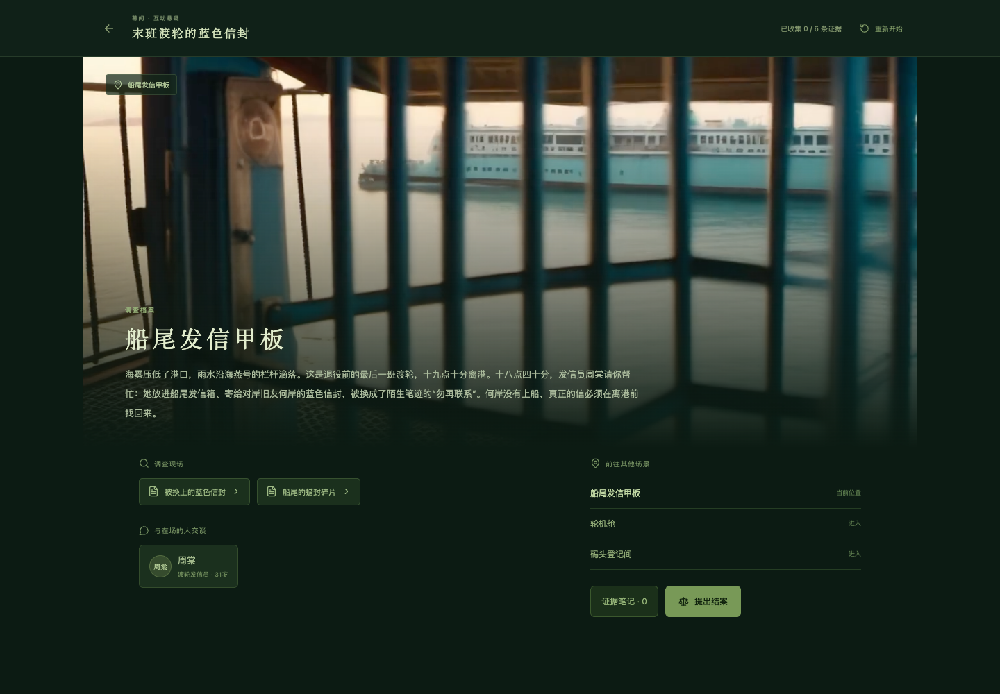

# 幕间 · 推理影游创作工坊

把一个悬疑故事，做成可以搜证、盘问和结案的互动作品。由 Pi 负责创作与修复，固定规则引擎检查证据链，DGX Spark 提供本地推理与素材生成。创作阶段生成镜头，游玩阶段读取素材，导出的 HTML 可以独立运行。

**开发状态：首版已在单台 DGX Spark 跑通案件生成、编辑、死锁修复、图片和参考图短视频生成。** 不把手工示例、示意插画、缓存播放或上游性能报告标成现场 AI 生成。交付入口见 [DELIVERY](docs/DELIVERY.md)，实测与限制见 [验收记录](docs/RELEASE-AUDIT.md)。



## 快速启动

Node.js ≥ 22.19，推荐 22 LTS。此仓库不包含模型权重、密钥或账号资料。

```bash
npm ci
cp .env.example .env
npm run build
npm start
```

打开 `http://127.0.0.1:4317`。没有模型服务时仍可体验原创手写示例、编辑案件、检查规则、试玩及导出；发起模型任务会明确报错，不回退成伪生成。

本地模型提供 OpenAI 兼容端点。在 `.env` 配置 `LLM_BASE_URL`、`LLM_MODEL`。使用 StepFun 时设置 `LLM_PROVIDER=stepfun` 与 `STEPFUN_API_KEY`；地区端点与 Key 必须匹配。密钥只在服务端读取。

## 创作流程

1. 新建作品，输入故事要求。Pi 读取专业技能、数据契约，调用草稿、检查与提交工具。
2. 在“剧本与证据”编辑场景、人物、对白、物证和真相。保存创建修订，旧版保留。未保存时阻止离开编辑页，可下载草稿或明确放弃；旧版本保存冲突不会覆盖新内容。
3. 在“场景与分镜”生成图片或视频，也可导入 PNG/JPEG。视频优先以当前场景图片为首帧。
4. 在“检查与修复”查看引用、场景与证据可达性，以及真实规则下的通关路径。
5. 使用只读叙事初审检查时间线与事实疑点，逐字引用原文；修改案件后旧初审提示过期，判断仍由作者核对。
6. 试玩搜证、出示证据问话、提交指认。规则错误会阻止 HTML 导出。

独立 HTML 内嵌当前素材与播放器，不依赖在线模型；案件 JSON 用于继续编辑。单个素材超过 80 MB 时会阻止单文件 HTML 导出，避免悄悄漏掉素材。数据保存在 `data/`，使用前可将这个目录整体备份。

## 为什么选择推理影游

新建短篇固定为三个场景、三个成年人物、六条证据、两种结局，首稿优先三个开放场景、五条现场物证与一条条件证词；导入和手动编辑支持契约范围内的其他规模。推理有明确的交付约束：证据能不能拿到、问话是否满足条件、是否存在可回放的结案路径。视频承担氛围和表演，重要日期、文字、判定由程序准确呈现。

已有视觉小说工具也能生成、编辑和导出。我们的参赛重点是可追溯的案件修改、证据约束、独立检查与本地媒体作业，不声称这些单项能力首创。详细取舍和来源见 [选题决策](docs/DECISION.md)，参赛展示流程见 [演示方案](docs/DEMO.md)。

## 架构

```text
浏览器工作台 ── Node / Express ── 项目版本、作业、素材缓存
                     │
                     ├─ Pi coding-agent SDK
                     │    ├─ 专业 Skill 按需读取
                     │    ├─ read / propose / validate / commit 受限工具
                     │    └─ 本地 vLLM / llama.cpp 或可选 StepFun
                     │
                     ├─ 固定案件检查器 → 可重放玩家动作 → 发布条件
                     │
                     └─ 单 GPU 作业队列 → Python 媒体服务
                                          ├─ SDXL 场景图片
                                          └─ Wan 2.2 TI2V 5B 视频
```

Pi 没有任意 shell 或文件写工具。模型只能修改案件数据，无法修改检查器。编辑采用版本冲突检查；修复任务只能调整依赖关系，不能改写人物、对白、证据文字、真相或结案要求。检查对应当前案件哈希，修改后必须重新验证。任务失败不覆盖已有作品。服务重启后未完成作业标记为中断，用户可重试。

条件语言只支持“已获得全部指定证据”，动作只增加证据。因此可以通过最小不动点完成可达性分析，不需要枚举所有可能台词或使用模型主观判定。检查器返回的动作列表使用与播放器相同的规则执行。这个证明范围不包含自然语言逻辑、叙事公平或趣味性，仍需作者审阅。

素材缓存键包含提示、视觉风格、相关人物设定、种子与首帧内容。渲染使用场景的镜头提示和视觉风格；目前人物设定用于缓存失效，作者还需把外观要求同步写入镜头提示。改变对白通常不影响空镜；改变视觉设定使相应素材过期，新图像也会使依赖旧首帧的视频过期。缓存复用和本次模型生成在记录中分开标记。

## DGX Spark 部署

见 [部署说明](docs/DEPLOYMENT.md)。实际测试目标为 Linux ARM64、GB10、CUDA 13.0。当前只绑定 loopback，远程访问使用 SSH 隧道；未实现公网多租户账号系统。

媒体基线不含配音。视频草稿为 768×448、49 帧、24 FPS、20 步；正式档为 1280×704、121 帧、24 FPS、50 步。图片为 1024×576，草稿 20 步、正式 30 步。这些是工作负载配置，**不是质量或延迟保证**。

当前没有接入 H3、配音或实时世界模型，视频在创作阶段预先生成。

## 测试与证据

```bash
npm run check
```

包含案件路径重放、死锁、缺失引用、证词条件、错误指认、版本冲突、缓存失效、HTML 脚本注入转义测试。真实模型与 GPU 结果单独记录，不能用单元测试替代。

本轮 35 项自动测试在 Mac 与 Spark 通过，覆盖真实 Pi 工具循环、只读初审与引文验证、修复越界、坏图片、请求来源、旧版恢复及取消恢复等。模拟模型测试不能代替真实模型效果。最新交付状态见 [交付验收](docs/RELEASE-AUDIT.md)，测试覆盖与复跑方式见 [对抗测试说明](docs/TESTING.md)。

以下为 9 月 21 日历史实测，不是当前模型延迟：新案件《童谣谜案》已通过浏览器搜证、解锁证词与结案；《陨石疑云》已验证保留真相的死锁修复。SDXL 1024×576 首图约 42.5 秒，热态下一图约 4.3 秒；Wan 参考图草稿为 768×448、49 帧、24 FPS、2.04 秒，实际任务约 184.3 秒，其中媒体模型加载约 94.8 秒。该历史批次尚未测试正式档。9 月 28 日补测正式档成功：1280×704、121 帧、24 FPS、5.04 秒，应用作业耗时 1699.939 秒（约 28 分 20 秒，含模型切换与加载），详见 [本轮记录](evidence/release-2026-09-27/README.md)。这些是少量现场记录，不能代表平均延迟；失败与人工反馈均保留，详见 evidence。尚未测量：真人创作效率、长期稳定性、成本对比、Skills 消融，以及连续角色的跨镜头一致性。请勿据此对外承诺冠军、商业长片质量或永久免费。

## Skills 与目录

- [case-design](skills/case-design/SKILL.md)：从真相倒推线索与人物阶段。
- [case-audit](skills/case-audit/SKILL.md)：读取固定检查器的实际结果，限制通过结论的范围。
- [case-consistency](skills/case-consistency/SKILL.md)：只读叙事初审、原文引用、反证与不确定性。
- [case-repair](skills/case-repair/SKILL.md)：保留真相与版本，修复具体依赖。
- [shot-direction](skills/shot-direction/SKILL.md)：镜头约束、输入指纹、局部重做与真实产物。

`src/core` 为契约、规则与检查器；`src/server` 为 Pi、作业与导出；`src/web` 为工作台与播放器；`scripts/media_worker.py` 为本地 GPU 服务。

## 提交材料

[参赛说明与清单](docs/SUBMISSION.md) · [逐镜录屏与口播](docs/VIDEO-SCRIPT.md) · [十日谈开发文章](docs/ARTICLE.md) · [当前验收状态](docs/RELEASE-AUDIT.md)

已发布征文：[DGX Spark 黑客松十日谈：幕间，把一个悬念做成可玩的故事](https://zhuanlan.zhihu.com/p/2088310219101179986)。仓库现已公开；视频发布与表单提交的实际进度见 [提交状态](docs/PUBLISHING.md)。

## 参赛与许可证

本届规则要求开源提交。9 月 29 日已补齐约 3 分 56 秒的 1080p 演示视频、封面与十日谈发布稿，并重新通过 35 项测试与构建。发布状态和提交记录见 [提交状态](docs/PUBLISHING.md)；准备好的本地文件不等同于已公开发布或已向组委会提交。

应用代码采用 MIT。Pi、llama.cpp、React 等依赖遵守各自许可证。模型权重不随仓库发布，SDXL、Wan、Qwen、Nemotron 与可选 StepFun 的使用条款分别适用。素材应使用有权使用的原始内容。参考项目仅用于调研，本仓库没有复制 Super-Idol-Master 或 IntelliVNG 的代码。
